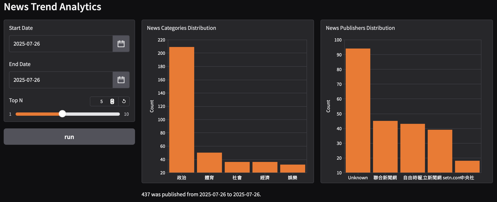

# 📰 &nbsp;News RAG Pipeline

A lightweight Retrieval-Augmented Generation (RAG) pipeline that allows users to query recent news, search semantically relevant content, and get natural language responses powered by Google Gemini.

## 🚀 &nbsp;Project Overview

This project builds an end-to-end pipeline combining ETL, vector search, and Large Language Models (LLMs) to summarize news articles based on a user's query. Beyond retrieval, it also provides insightful analytics into news distribution across categories and publishers over time.

### 🔧 &nbsp;Components

| Component        | Tool/Tech                         |
|----------------|:---------------------------------:|
| ETL Pipeline     | Apache Airflow                    |
| Embedding Model  | `BAAI/bge-m3` via SentenceTransformer |
| Vector Database  | PostgreSQL with `pgvector` extension |
| LLM              | Google Gemini Pro 2.5 (via API)   |
| Backend API      | FastAPI                          |
| Frontend         | Gradio                           |
| Language         | Python 3.10+                     |
| Dependency Mgmt  | `requirements.txt`               |

---

## 📦 &nbsp;Features

- **Automated ETL with Airflow**  
  Periodically crawls and stores the latest news content from sources.

- **Embedding & Vector Search**  
  Converts text into dense vectors using `BAAI/bge-m3` and stores them in PostgreSQL using `pgvector`.

- **RAG with Gemini API**  
  Uses Gemini 2.5 Pro to generate natural language answers based on top-k similar articles.

- **News Trend Analytics Visually explore news distribution with interactive bar charts:**
  - Top Categories: Identify the most dominant news categories within a specified date range.
  - Top Publishers: Understand which publishers are most active or have the most articles in a given period.

- **API & UI**  
  - FastAPI serves the backend logic.  
  - Gradio provides a simple web interface for interaction.

---

## ⚙️ &nbsp;Setup Instructions

### 1. Clone the Repository

```bash
git clone https://github.com/your-username/news-rag-pipeline.git
cd news-rag-pipeline
```

### 2. Install Dependencies

```bash
python3.10 -m venv .venv
source .venv/bin/activate
pip install -r requirements.txt
```

###  3. Environment Variables

Create a .env file and add your Gemini API key:

```env
AIRFLOW_UID={AIRFLOW_UID}
NEWS_DB_URL={postges url}
GEMINI_API_KEY={GEMINI_API_KEY}
```

### 4. Run ETL (via Airflow)

Make sure Airflow is configured properly to run the DAGs that fetch and embed news.

```bash
# Start Airflow scheduler and webserver
airflow scheduler
airflow webserver
```

### 5. Run Backend

Make sure Airflow is configured properly to run the DAGs that fetch and embed news.

```bash
uvicorn app.main:app --reload
```

### 6. Launch Gradio UI

Make sure Airflow is configured properly to run the DAGs that fetch and embed news.

```bash
python gradio_app.py
```

## 📥 &nbsp;Example Usage

**Chat Interface**


The pipeline will:
1.	Search relevant news from the vector store
2.	Construct a prompt using top results
3.	Send the prompt to Gemini API
4.	Display the summary in the UI

**Expected Output (Chat and Raw Data Section):**

_(Example of Raw API Response JSON)_

```
{
  "query": "string",
  "answer":
  {
      "summary":
      "近期社會新聞事件涵蓋多個面向。其中..."
      "references":[
          {
              "news_id": 001,
              "title": "...",
              "publisher": "..."
          }, ...
      ]
  }
  "result":
  [
      {
          "news_id": 1,
          "similarity": 0.5624959953117447,
          "content": "...",
          "metadata": {
              "news_id": 1,
              "title": "...",
              "category": "社會",
              "chunk_idx": 200,
              "publisher": "...",
              "pubished_at": "date time"
          }
      }, ...
  ]
}
```

**News Trend Analytics**

Select a date range and the number of top results, then click "Analyze Data" to visualize the distribution of news categories and publishers.




## 🧠 &nbsp;Model Info

- **LLM**: gemini-2.5-pro via Google API

- **Embedding**: BAAI/bge-m3 (optimized for multilingual retrieval)

- **Vector DB**: PostgreSQL + pgvector 

- **ETL**: Airflow

## 🙌 &nbsp;Acknowledgements
- [Apache Airflow](https://airflow.apache.org/)
- [BAAI / bge-m3](https://huggingface.co/BAAI/bge-m3)
- [FastAPI](https://fastapi.tiangolo.com/)
- [Google Gemini](https://ai.google.dev/)
- [Gradio](https://www.gradio.app/)
- [pgvector](https://github.com/pgvector/pgvector)


